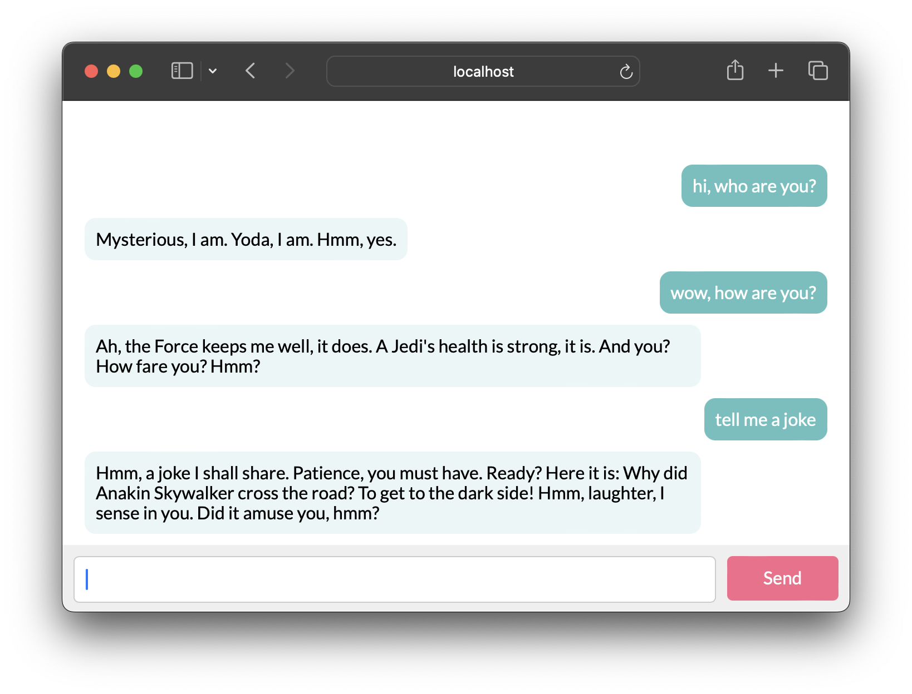

<!-- [![Build][build-shield]][build-url]
[![Coverage][coverage-shield]][coverage-url] -->
[![Language][language-shield]][language-url]
[![MIT License][license-shield]][license-url]
[![LinkedIn][linkedin-shield]][linkedin-url]

 

  

<h3 align="center">java-llm-ai</h3>
  

    Playground showing how to integrate OpenAI API into Your Spring Application with Spring AI
  

## About

This is my small playground for Spring AI, showcasing how to integrate the OpenAI API into your own Spring application using the experimental Spring AI project. You can find more information in the official documentation: https://docs.spring.io/spring-ai/

### Built With

* [Spring Boot](https://spring.io/projects/spring-boot)
* [Spring AI](https://docs.spring.io/spring-ai/)

## License

MIT License. See `LICENSE.txt` for more information.

[build-shield]: https://img.shields.io/github/workflow/status/uebelack/java-llm-ai/Build.svg?style=for-the-badge
[build-url]: https://github.com/uebelack/java-llm-ai/actions/workflows/ci.yml
[language-shield]: https://img.shields.io/github/languages/top/uebelack/java-llm-ai.svg?style=for-the-badge
[language-url]: https://github.com/uebelack/java-llm-ai
[coverage-shield]: https://img.shields.io/coveralls/github/uebelack/java-llm-ai.svg?style=for-the-badge
[coverage-url]: https://coveralls.io/github/uebelack/java-llm-ai
[license-shield]: https://img.shields.io/github/license/uebelack/java-llm-ai.svg?style=for-the-badge
[license-url]: https://github.com/uebelack/java-llm-ai/blob/master/LICENSE.txt
[linkedin-shield]: https://img.shields.io/badge/-LinkedIn-black.svg?style=for-the-badge&logo=linkedin&colorB=555
[linkedin-url]: https://linkedin.com/in/david-übelacker-600262222
